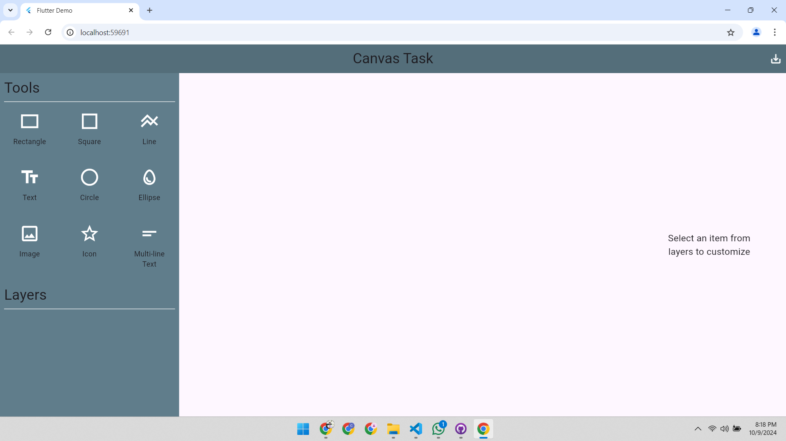
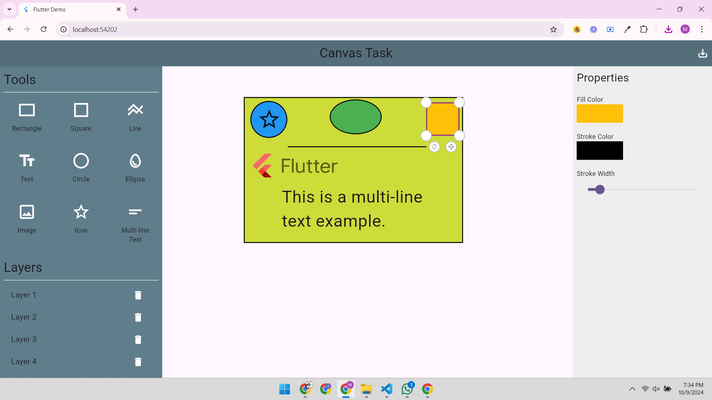
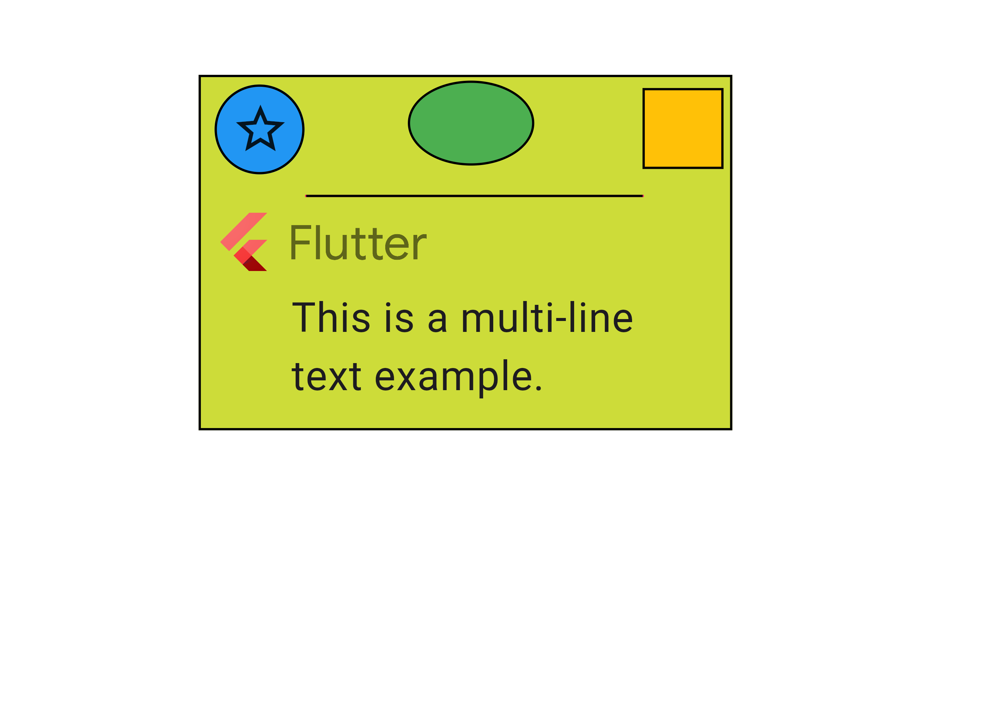

# Flutter Canvas Task

This is a **Flutter** application for creating, customizing, and manipulating various shapes, text, and images on a canvas. The app uses **GetX** for state management to efficiently manage UI interactions. Users can manage layers, adjust properties (like fill and stroke colors, stroke width, and dimensions), and export their design as a PNG image.

## Table of Contents

- [Features](#features)
- [Getting Started](#getting-started)
- [Usage](#usage)
- [Folder Structure](#folder-structure)
- [Technologies Used](#technologies-used)
- [Screenshots & Video](#screenshots--video)

## Features

- **Add Shapes & Elements**: Add rectangles, squares, circles, ellipses, text, and images to the canvas.
- **Customization**: Adjust properties like fill color, stroke color, stroke width, and element size.
- **Layer Management**: Add, delete, and reorder layers.
- **Export Design**: Export the canvas as a PNG image.

## Getting Started

This section provides the prerequisites and instructions to set up the project locally for development and testing purposes.

### Prerequisites

Before you begin, ensure you have the following tools installed:

- [Flutter SDK](https://flutter.dev/docs/get-started/install)
- [Dart SDK](https://dart.dev/get-dart)
- [Git](https://git-scm.com/)

## Usage

1. **Adding Elements**: 
   - Use the toolbar on the left to add shapes like rectangles, squares, circles, ellipses, text, and images to the canvas.
   
2. **Customizing Elements**:
   - Click on any element to open the properties panel on the right, where you can adjust properties like fill color, stroke color, stroke width, and dimensions.

3. **Managing Layers**:
   - Reorder layers by selecting elements from the layer list. You can also delete layers by clicking the delete button.

4. **Exporting the Canvas**:
   - Once you're satisfied with the design, click the export button to download the canvas as a PNG image.

## Folder Structure

- **controllers/**: Contains GetX controllers for managing state and logic
  - `home_controller.dart`: Handles the logic for the home view and stack board.
  - `stack_board_controller.dart`: Manages stack board interactions and element properties.
  
- **models/**: Data models for canvas elements and customization options.
  - `color_stack_item.dart`: Defines properties for custom elements like color, stroke, etc.
  
- **views/**: UI components and screens.
  - `home_view.dart`: Main UI screen for the canvas.
  - `tool_button.dart`: Reusable widget for the tool buttons.
  
- **widgets/**: Reusable widgets for properties and UI components.
  - `properties_section.dart`: Widget for adjusting element properties (fill, stroke, etc.).
  
- **responsive/**: Handles responsive design for different screen sizes.
  - `responsive.dart`: Logic to make the app responsive across devices.
  
- **utils/**: Utility functions or constants used across the project.
  - `constants.dart`: Contains reusable constants and configurations.
  
- **main.dart**: Entry point of the application.

The `responsive.dart` file contains logic that automatically adjusts the layout based on the screen size.

## Technologies Used

- **Flutter**: Cross-platform mobile, web, and desktop development framework.
- **GetX**: Lightweight state management library for reactive UI and efficient data handling.
- **Flutter Color Picker**: Library for color picking and customization.
- **Dart**: Programming language for Flutter development.

## Screenshots & Video

### Screenshots

Below are some screenshots showcasing the app:

### Demo Video

You can download or watch the video by [clicking here](assets/screen-capture.mp4).

